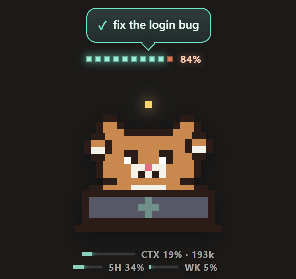
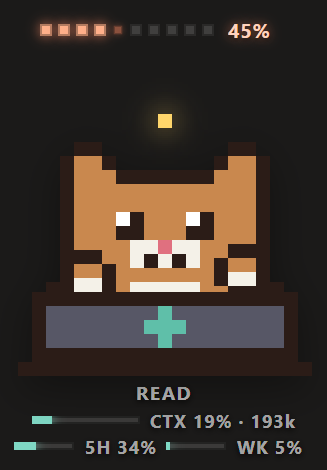
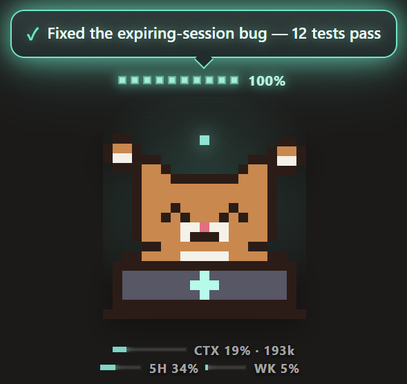
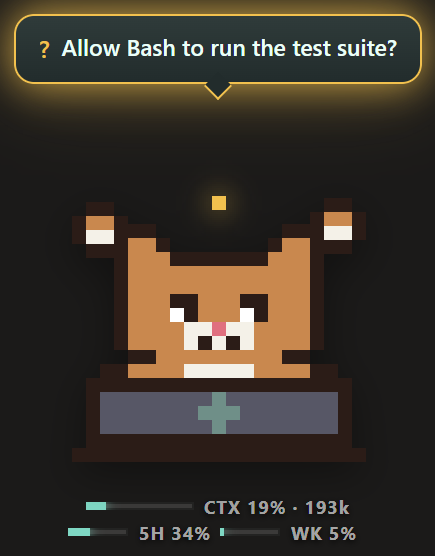
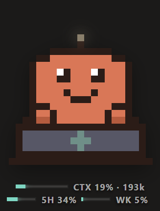
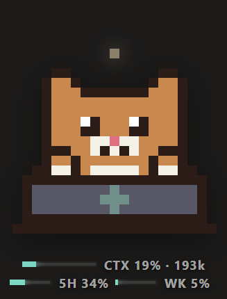
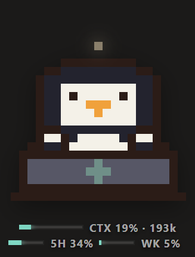

<div align="center">

# Claude Pet 🐾

**A desktop pet that follows what Claude Code is doing.**

Dot progress above its head, typing on a laptop while tools run,
and a glowing sign held up when the answer lands.



Windows · macOS · [한국어](README.ko.md)

</div>

---

## What it shows

| | |
|---|---|
|  | **Real progress, not a spinner.** The dots come from your `TodoWrite` list — completed / total, with the in-progress item counted as half so the bar never looks stuck. No todos? It estimates from tool-call count. The label under the pet is the tool running right now. |
|  | **The result, held up and glowing.** On `Stop` the pet reads the first line of Claude's last message straight out of the transcript and holds it over its head. |
|  | **Amber when Claude needs you.** A permission prompt or any `Notification` puts the pet in waiting mode, so you notice from across the desk. |

Under the pet: **context usage** (`CTX 19% · 193k`) and **plan limits** (`5H 34% · WK 5%`). Mint under 65%, amber to 85%, red past that.

## States

| Mode | When | Looks like |
|---|---|---|
| `idle` | nothing running | slow breathing, status light dim |
| `thinking` | right after you hit enter | looks up, light pulses fast |
| `coding` | a tool is running | types on the laptop, dots + tool name |
| `waiting` | permission / input needed (`Notification`) | holds an amber `?` sign |
| `done` | response finished (`Stop`) | happy face, 100%, glowing mint sign |
| `error` | pushed manually | red glowing sign |

## Characters

<div align="center">
  
</div>

Tray menu → **Character**. Size (×0.75–×1.6) and language (English / 한국어) live there too; language follows your OS locale by default. Everything is saved.

## Install

```bash
git clone https://github.com/vkdldjsk2-lang/claude-pet.git
cd claude-pet
npm install
npm start
```

Want to see it move before wiring anything up:

```bash
npm run demo
```

> **Windows:** if you get `Electron failed to install correctly`, the binary unzip was cut short. Delete `node_modules/electron/dist` and run `node node_modules/electron/install.js` again.

The app lives in the tray (Windows notification area / macOS menu bar). Click the icon to show or hide it; right-click for always-on-top, click-through, character, size, language and quit. Drag the pet anywhere — the position sticks.

## Connect it to Claude Code

The pet listens on `127.0.0.1:4577`. Install the hooks and Claude Code pushes its state:

```bash
npm run install-hooks
```

This adds seven hooks to `~/.claude/settings.json`. Your existing file is backed up to `settings.json.claude-pet.bak`, and other hooks are left alone.

| Claude Code hook | Pet event |
|---|---|
| `SessionStart` | `session_start` |
| `UserPromptSubmit` | `prompt` |
| `PreToolUse` | `tool_start` |
| `PostToolUse` | `tool_end` — reads `TodoWrite` todos for the progress bar |
| `Notification` | `notification` |
| `Stop` | `stop` — reads the last reply from the transcript for the sign |
| `SessionEnd` | `session_end` |

Project only: `node scripts/install-hooks.js --project`. Remove: `npm run uninstall-hooks`.

Restart Claude Code and the pet follows along. When the pet isn't running the hooks fail silently, so Claude Code is never blocked.

### Context usage

Every hook event carries it. The `usage` on the last assistant message in the transcript (`input + cache_read + cache_creation`) is what's filling your context window right now. Default ceiling is 200k — set `CLAUDE_PET_CONTEXT_MAX`, or push the real one (below). Check the parser with `node scripts/hook.js --selftest`.

### Plan limits (5-hour / weekly)

**These can only be read from inside a Claude Code session.** They are not in the hook payload, not in the transcript, not in `~/.claude/sessions` or `session-env` — the `rateLimits` string you'll find in there is only a 429 error message — and there is no `claude` CLI subcommand for them. So there's no polling path; the pet takes them by push:

```bash
node scripts/plan.js 34 5 "2h 41m" 1000000   # 5h% weekly% resetsIn contextWindow
```

Use whatever the desktop app's usage card (or `get_usage` inside a session) shows. Push the context window along with it and hook events won't overwrite it.

Because that number goes stale, the pet shows its age beside it (`12m ago`) and turns amber past 30 minutes. A visibly old number beats a fresh-looking wrong one.

Cumulative tokens and cost are left out — they'd need a full transcript scan.

## Push state from anything

Useful from CI, build scripts, or any long-running job:

```bash
node scripts/say.js coding 42 "Running tests"
node scripts/say.js done 100 "Deploy finished"
```

```bash
curl -X POST http://127.0.0.1:4577/event -H "Content-Type: application/json" \
  -d '{"event":"set","mode":"done","percent":100,"message":"Deploy finished"}'
```

`GET /health` returns the current state. Change the port with `CLAUDE_PET_PORT`; the port actually in use is written to `~/.claude-pet/port` (if 4577 is taken it walks up).

## Draw your own character

Every sprite is a string in [`src/sprites.js`](src/sprites.js) — one character is one dot, and `PALETTE` maps characters to colors. Add an entry to `CHARACTERS` and you're done: the laptop, paws, animation, glow and typing are all shared.

```js
const CHARACTERS = {
  blob:    { BODY, BLINK, UP, HAPPY, PAW },
  cat:     { ... },
  penguin: { ... },
};
```

- `BODY` is 21 x 13
- `BLINK` (eyes shut) / `UP` (looking up) / `HAPPY` (done) are `BODY.slice()` with the eye rows swapped
- `A` at row 0, column 10 is the status light — the renderer paints glow on that cell, so don't move it
- `PAW` sits against a dark background when raised, so don't make it too dark

Preview in a browser, no Electron needed:

```bash
node dev/serve.js
```

`http://localhost:5188` has buttons for every state, character and size.

Row widths and unknown palette characters — one cell off shifts the whole face, and it's hard to spot by eye:

```bash
node -e "const S=require('./src/sprites');for(const[n,c]of Object.entries(S.CHARACTERS))for(const k of['BODY','BLINK','UP','HAPPY'])c[k].forEach((r,i)=>{if(r.length!==S.GRID_W)throw Error(n+'.'+k+' '+i)});console.log('ok')"
```

## Translate it

[`src/i18n.js`](src/i18n.js) holds every string as `{ en: {...}, ko: {...} }`. Add a language there, add it to the tray submenu in `src/main.js`, done. Keys have to match across languages:

```bash
node -e "const I=require('./src/i18n'),a=require('assert');a.deepStrictEqual(Object.keys(I.STRINGS.en).sort(),Object.keys(I.STRINGS.ko).sort());console.log('ok')"
```

## Build installers

```bash
npm run dist:win   # NSIS installer + portable exe
npm run dist:mac   # dmg + zip
```

## Layout

```
src/main.js              Electron main - window, tray, settings, demo
src/server.js            127.0.0.1 event receiver
src/state.js             hook events -> pet state (progress math lives here)
src/sprites.js           pixel sprites per character + palette + layout
src/i18n.js              all UI strings
src/icon.js              dependency-free PNG encoder (tray icon, built at runtime)
src/preload.js           contextBridge (window.claudePet)
src/renderer/            canvas rendering, dot progress, glowing sign, gauges
scripts/hook.js          Claude Code hook -> pet bridge
scripts/install-hooks.js hook install / remove
scripts/say.js           push a state by hand
scripts/plan.js          push plan-limit usage
dev/preview.html         browser preview
dev/shots.js             regenerates the README images (Electron + ffmpeg)
```

## License

MIT
